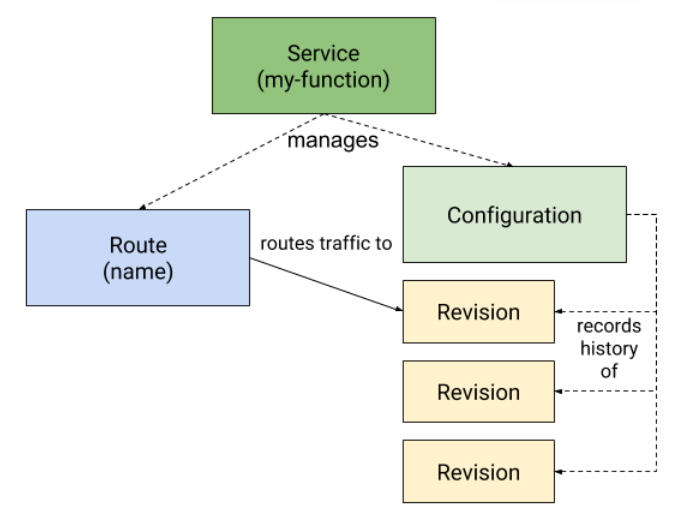

# Concept

Knative có 2 "tính năng" chính là Knative Serving vs Knative Eventing.

## Knative Serving

Knative định nghĩa ra một loạt các đối tượng được gọi là Kubernetes Custom Resource Definitions (CRDs). Những resource này sẽ định nghĩa và điều khiển cách mà các serverless workload hoạt động trên cluster.

Các resource chính của knative serving là  Services, Routes, Configurations, và Revisions

- `Services`: Quản lý toàn bộ vòng đời của workload. Nó tham gia vào quá trình khởi tạo của các đối tượng khác để đảm bảo workload sẽ có đủ route, config, revision. Nó có thể được định nghĩa để luôn route traffic vào update mới nhất.
- `Routes`: Resource này map network endpoint với 1 hoặc nhiều revision.
- `Configurations`: Maintain trạng thái của deployment, thay đổi cấu hình sẽ tạo ra 1 revison mới.
- `Revisions`: point-in-time snapshot của code và config cho mỗi 1 lần thay đổi của workload. Revision không thể thay đổi và có thể scale up down dựa vào lượng traffic tới.

### Use case

- Triển khai nhanh serverless container
- Auto scaling, bao gồm cả scale pod xuống 0
- Hỗ trợ nhiều networking layer bao gồm Contour, Kourier, Istio
- Hỗ trợ cả HTTP và HTTPS

## Knative Eventing

Eventing là tập hợp của các API cho phép sử dụng kiến trúc event-driven cho app. Có thể sử dụng để tạo các thành phần điều hướng event từ event producer (source) đến event consumer (sink). Sink cũng có thể được cấu hình để respond http request bằng cách gửi lại response event.

Eventing support cả K8s services lẫn knative serving service. Eventing sử dụng HTTP POST request để gửi và nhận event giữa source và sink. Các event này cần tuân thủ CloudEvent.

