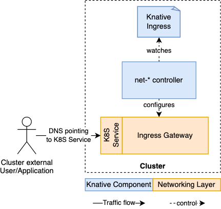
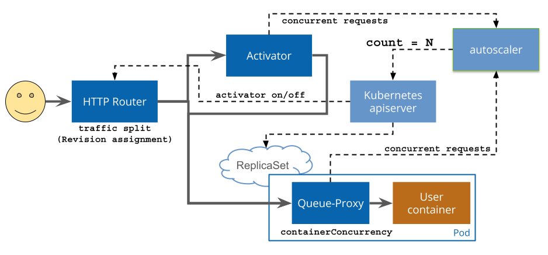

# Knative Serving

## 1. Kiến trúc

### Các thành phần

- `Activator` : Một phần của `data-plane`, có nhiệm vụ queue request lại trong trường hợp service đã scale về 0. Sau đó nó sẽ contact với autoscaler để bật lại service và forward những request đang bị queue tới đó. Nó cũng có thể hoạt động như 1 lớp đệm.

- `Autoscaler` : có nhiệm vụ scale knative services dựa vào config, metric và request.

- `Controller` : Controller quản lý trạng thái của Knative resources.

- `Queue-Proxy` : Thu thập metric và thực thi việc đảm bảo số lượng connection đồng thời xuống container. Nó cũng có thể hoạt động như 1 queue nếu cần, tương tự Activator.

- `Webhook` : Knative có 1 vài webhook chịu trách nhiệm validate và mutate Knative resources.

### Networking layer và Ingress

Ingress trong trường hợp này không ám chỉ k8s ingress mà là chỉ concept của việc expose external access vào resource bên trong.

Knative phụ thuộc vào 1 lớp networking layer. Knative serving định nghĩa ra internal `KIngress`, hoạt động như 1 lớp abstraction cho các loại networking layer khác nhau.

Đang có 3 loại networking layer đó là:

- net-kourier
- net-istio
- net-contour

### Traffic flow và DNS

- Mỗi một networking layer có 1 controller có nhiệm vụ theo dõi KIngress resource và cấu hình Ingress gateway theo nó.
- Ingress gateway được dùng để route request tới activator hoặc là tới trực tiếp Knative service pod luôn, phụ thuộc vào mode (proxy hoặc serve). Nó sẽ handle request từ cả trong và ngoài cluster.
- Để ingress gw có thể access từ bên ngoài, nó phải được expose ra bên ngoài thông qua k8s service type LB hoặc node port. Lớp networking layer sẽ làm phần này, việc của mình là trỏ dns tới nó.

## HTTP Request Flows

### Scale from zero

Khi có lượng traffic tới revision cụ thể, htto router sẽ gửi traffic tới activator, activator sẽ serve lượng request này, nếu request được route tới Revision mà không có đủ capacity thì activator sẽ delay lại và gửi tín hiệu cho autoscaler báo cần add thêm tài nguyên.

Khi autoscaler phát hiện ra cần thêm tài nguyên, nó sẽ tăng thêm số lượng pod. Sau đó thì activator sẽ gửi traffic đang bị delay tới các pod này.

### High scale

Khi lượng traffic lớn tới Revision thì ingress router sẽ làm việc trực tiếp với địa chỉ pod của Revision chứ không cần đi qua activator nữa. Nó sẽ làm tăng hiệu năng và giảm độ trễ khi mà buffering của activator là không cần thiết. Tuy nhiên queue proxy sẽ luôn cần trong mọi request path.

Lượng traffic tới revision có ngưỡng gọi là burst capacity threshold. Khi mà ngưỡng request thấp hơn ngưỡng này thì traffic sẽ lại đi qua activator.
