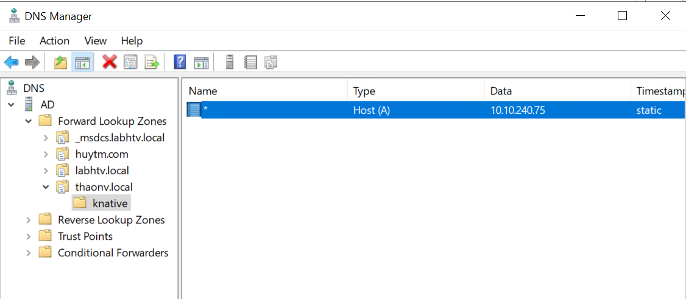

# Hướng dẫn cài đặt Knative bằng YAML

## Knative Serving

### Yêu cầu:

- Đã cài đặt K8s v1.26 hoặc mới hơn với metal LB
- Đã cài đặt kubectl CLI
- Có internet access

### Cài đặt

Cài đặt custom resource require

`kubectl apply -f https://github.com/knative/serving/releases/download/knative-v1.12.3/serving-crds.yaml`

Cài đặt thành phần core

`kubectl apply -f https://github.com/knative/serving/releases/download/knative-v1.12.3/serving-core.yaml`

Cài đặt networking layer, ở đây mình dùng Kourier

`kubectl apply -f https://github.com/knative/net-kourier/releases/download/knative-v1.12.3/kourier.yaml`

Config knative serving sử dụng Kourier

```
kubectl patch configmap/config-network \
  --namespace knative-serving \
  --type merge \
  --patch '{"data":{"ingress-class":"kourier.ingress.networking.knative.dev"}}'
```

Kiểm tra IP external của Kourier

`kubectl --namespace kourier-system get service kourier`

Lưu IP này lại

Cấu hình DNS, tạo 1 bản ghi A

*.knative.thaonv.local == A 10.10.240.75



Config knative sử dụng domain này

```
kubectl patch configmap/config-domain \
  --namespace knative-serving \
  --type merge \
  --patch '{"data":{"knative.thaonv.local":""}}'
```

Knative hỗ trợ Kubernetes Horizontal Pod Autoscaler (HPA), cài đặt bằng câu lệnh

`kubectl apply -f https://github.com/knative/serving/releases/download/knative-v1.12.3/serving-hpa.yaml`

