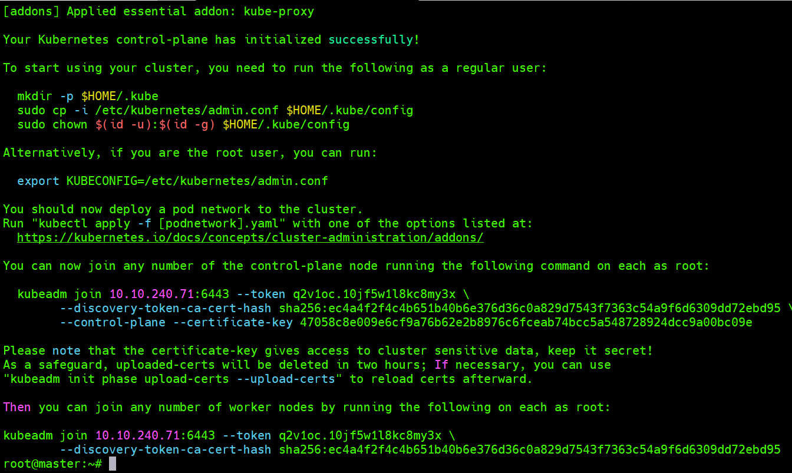
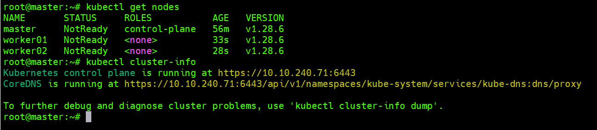

# Cài đặt K8s trên ubuntu 22

Mô hình:
- 1 Master
- 2 Worker

## Cài đặt trên tất cả các node

Set hostname

```
hostnamectl set-hostname master
hostnamectl set-hostname worker01
hostnamectl set-hostname worker02
```

Set file hosts

```
cat << EOF > /etc/hosts
127.0.0.1 localhost
127.0.1.1 worker01
10.10.240.71 master
10.10.240.72 worker01
10.10.240.73 worker02
EOF
```

Disable auto upgrade packages
```
vi  cat /etc/apt/apt.conf.d/20auto-upgrades
APT::Periodic::Update-Package-Lists "0";
APT::Periodic::Unattended-Upgrade "0";
```

Update

`sudo apt update`

Disable swap

```
sudo swapoff -a
sudo sed -i '/ swap / s/^\(.*\)$/#\1/g' /etc/fstab
```

Load the following kernel modules


```
sudo tee /etc/modules-load.d/containerd.conf <<EOF
overlay
br_netfilter
EOF
sudo modprobe overlay
sudo modprobe br_netfilter
```

Set parameters

```
sudo tee /etc/sysctl.d/kubernetes.conf << EOT
net.bridge.bridge-nf-call-ip6tables = 1
net.bridge.bridge-nf-call-iptables = 1
net.ipv4.ip_forward = 1
EOT
sudo sysctl --system
```

Cài đặt container runtime

```
sudo apt install -y curl gnupg2 software-properties-common apt-transport-https ca-certificates
sudo curl -fsSL https://download.docker.com/linux/ubuntu/gpg | sudo gpg --dearmour -o /etc/apt/trusted.gpg.d/docker.gpg
sudo add-apt-repository "deb [arch=amd64] https://download.docker.com/linux/ubuntu $(lsb_release -cs) stable"
sudo apt update
sudo apt install -y containerd.io
```

Config containerd

```
containerd config default | sudo tee /etc/containerd/config.toml >/dev/null 2>&1
sudo sed -i 's/SystemdCgroup \= false/SystemdCgroup \= true/g' /etc/containerd/config.toml
```

Enable containerd

```
$ sudo systemctl restart containerd
$ sudo systemctl enable containerd
```

Add K8s repo

```
curl -fsSL https://pkgs.k8s.io/core:/stable:/v1.28/deb/Release.key | sudo gpg --dearmor -o /etc/apt/keyrings/kubernetes-apt-keyring.gpg
echo 'deb [signed-by=/etc/apt/keyrings/kubernetes-apt-keyring.gpg] https://pkgs.k8s.io/core:/stable:/v1.28/deb/ /' | sudo tee /etc/apt/sources.list.d/kubernetes.list
```

Install k8s

```
sudo apt update
sudo apt install -y kubelet kubeadm kubectl
sudo apt-mark hold kubelet kubeadm kubectl
```

## Thực hiện trên node master

Init cluster

```
sudo kubeadm init --v=5 \
--upload-certs \
--control-plane-endpoint 10.10.240.71:6443 \
--pod-network-cidr=10.244.0.0/16
```

Copy token để join worker node



Chạy trên các node worker

```
kubeadm join 10.10.240.71:6443 --token q2v1oc.10jf5w1l8kc8my3x \
        --discovery-token-ca-cert-hash sha256:ec4a4f2f4c4b651b40b6e376d36c0a829d7543f7363c54a9f6d6309dd72ebd95
```

Cấu hình kubectl

```
sudo mkdir -p $HOME/.kube
sudo cp -i /etc/kubernetes/admin.conf $HOME/.kube/config
sudo chown $(id -u):$(id -g) $HOME/.kube/config


echo "alias k='kubectl'" >> /root/.bashrc
bash
```

Kiểm tra

```
kubectl cluster-info
kubectl get nodes
```



Cài đặt calico plugin

`kubectl apply -f https://raw.githubusercontent.com/projectcalico/calico/v3.26.0/manifests/calico.yaml`

Kiểm tra

`kubectl get pods -n kube-system`

`kubectl get nodes`

## Cài đặt NFS làm PVC cho cluster

Cài đặt NFS tại master node

```
sudo apt install nfs-kernel-server -y
systemctl enable nfs-kernel-server

mkdir /opt/k8s-pvc

echo "/opt/k8s-pvc *(rw,sync,fsid=0,no_subtree_check,no_root_squash)" >> /etc/exports

systemctl restart nfs-kernel-server rpcbind
```

Tại các node worker cài đặt nfs-common

```
apt install nfs-common -y

mkdir /opt/k8s-pvc
mount -t nfs 10.10.240.71:/opt/k8s-pvc /opt/k8s-pvc
echo "10.10.240.71:/opt/k8s-pvc /opt/k8s-pvc  nfs      defaults    0       0" >> /etc/fstab
```

Install helm trên master node

`curl https://raw.githubusercontent.com/helm/helm/master/scripts/get-helm-3 | bash`

Cài đặt NFS external provisioner bằng helm

`helm repo add nfs-subdir-external-provisioner https://kubernetes-sigs.github.io/nfs-subdir-external-provisioner/`

`helm install nfs-subdir-external-provisioner nfs-subdir-external-provisioner/nfs-subdir-external-provisioner --set nfs.server=10.10.240.71 --set nfs.path=/opt/k8s-pvc --set storageClass.name=nfs`

```
kubectl patch storageclass nfs -p '{"metadata": {"annotations":{"storageclass.kubernetes.io/is-default-class":"true"}}}'
```

`kubectl get sc`

Tạo thử 1 deployment sử dụng sc vừa tạo

```
cat << EOF > deployment.yaml
apiVersion: v1
kind: PersistentVolumeClaim
metadata:
  name: nfs-pvc-test-dynamic
spec:
  #storageClassName: nfs # SAME NAME AS THE STORAGECLASS
  accessModes:
    - ReadWriteMany
  resources:
    requests:
      storage: 50Mi
---
apiVersion: apps/v1
kind: Deployment
metadata:
  labels:
    app: nginx
  name: nfs-nginx
spec:
  replicas: 1
  selector:
    matchLabels:
      app: nginx
  template:
    metadata:
      labels:
        app: nginx
    spec:
      volumes:
      - name: nfs-test 
        persistentVolumeClaim:
          claimName: nfs-pvc-test-dynamic 
      containers:
      - image: nginx
        name: nginx
        volumeMounts:
        - name: nfs-test 
          mountPath: /usr/share/nginx/html 
EOF
```

`kubectl apply -f deployment.yaml`

`kubectl get pvc`

Nếu thấy pv ở trạng thái `Bound` thì là đã thành công.

`kubectl delete -f deployment.yaml`

## Cài đặt MetalLB

```
helm repo add metallb https://metallb.github.io/metallb
helm install metallb metallb/metallb

cat <<EOF >  metallb-pool.yaml
apiVersion: metallb.io/v1beta1
kind: IPAddressPool
metadata:
  name: metallb-pool
spec:
  addresses:
  - 10.10.240.74-10.10.240.79
EOF

cat <<EOF >  l2-ad.yaml
apiVersion: metallb.io/v1beta1
kind: L2Advertisement
metadata:
  name: l2
  #namespace: metallb-system
spec:
  ipAddressPools:
  - metallb-pool
EOF

kubectl apply -f metallb-pool.yaml
kubectl apply -f  l2-ad.yaml
```

## Cài đặt Nginx làm ingress

```
helm repo add nginx-stable https://helm.nginx.com/stable
helm install k8s-ingress nginx-stable/nginx-ingress

kubectl get svc
```

Nếu thấy có external IP là đã cài đặt thành công.